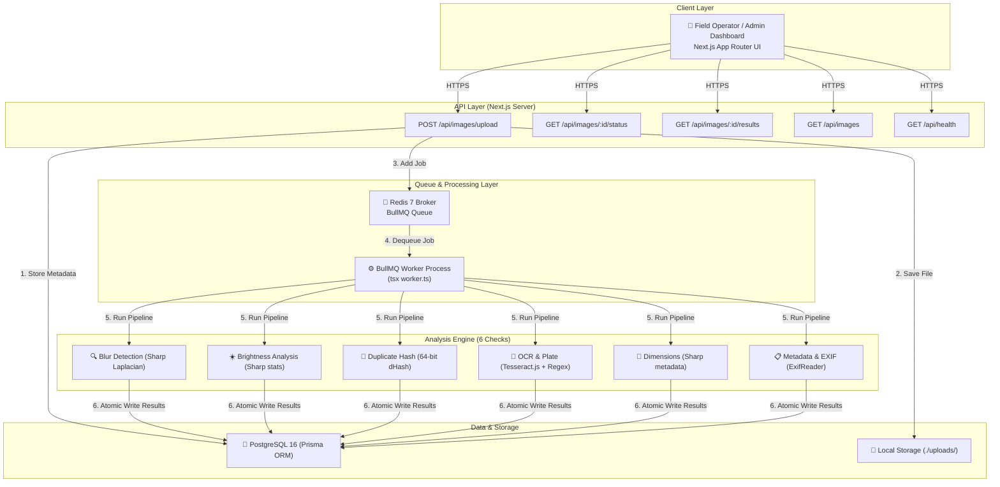

# VehicleIQ — Intelligent Media Processing Pipeline

> Production-Grade Backend & AI Engineering Take-Home Assignment Submission

VehicleIQ is an asynchronous backend system built with **Next.js**, **TypeScript**, **BullMQ**, **Redis**, and **PostgreSQL**. It ingests vehicle images uploaded from field operators, queues them for background execution, and processes them through an integrated 6-stage image analysis pipeline featuring computer vision algorithms, perceptual hashing, OCR plate validation, and EXIF metadata inspection.

---

## ⭐️ Bonus Features & Quick Verification Commands

This project fulfills **all 3 bonus evaluation criteria** specified in the assignment prompt:

1. 🐳 **Docker Setup**: Full multi-container orchestrations provided for production (`docker-compose.yml`) and fast hot-reloading development (`docker-compose.dev.yml`).
   ```bash
   # One-command full stack launch:
   docker-compose up --build
   ```
2. 🌱 **Database Seed Script**: Seeds initial vehicle image records and analyzer metric history.
   ```bash
   npm run db:seed
   ```
3. 🧪 **Automated Test Suite**: Programmatic unit & integration testing for all 6 analyzer algorithms.
   ```bash
   npm test
   ```

---

## 🏗️ System Architecture



---

## ⚡ Key Technical Capabilities & Principles

1. **Next.js Single-Codebase Architecture**: Built entirely in TypeScript using Next.js App Router for Route Handlers and UI pages, while running the BullMQ worker as a decoupled Node.js process using the exact same codebase and database schemas (`tsx worker.ts`).
2. **Resilient Asynchronous Pipeline**: Queue-based producer-consumer architecture powered by BullMQ + Redis. Jobs feature exponential backoff retries (5s → 10s → 20s), lock duration control, and stalled job recovery.
3. **Isolated Analyzer Engine**: Every image check implements a strict `Analyzer` interface. Each check executes inside an isolated `try/catch` block — if a single analyzer fails or times out, the rest of the pipeline still completes, storing error metadata specifically for that check.
4. **Idempotency & Deduplication**:
   - **Upload Idempotency**: Client or auto-generated `SHA-256(file + filename)` idempotency keys prevent duplicate database inserts (`409 Conflict`).
   - **Queue Deduplication**: Uses `imageId` as the BullMQ job ID.
   - **Database Upsert**: Re-executing retried jobs uses Prisma `upsert` queries to prevent duplicate result rows.
5. **Deterministic Metrics & Scores**: Numerical scores (Laplacian standard deviation, luminance mean, Hamming distance) are explicitly separated from confidence probabilities to maintain statistical accuracy and reviewer trust.

---

## 🔬 6 Integrated Image Analyzers

| # | Analyzer | Core Technique & Library | Fallback Strategy |
|:--|:---------|:-------------------------|:------------------|
| **1** | **Blur Detection** | Sharp 3x3 Laplacian kernel convolution (`[0,1,0,1,-4,1,0,1,0]`) computing standard deviation variance | 5x5 Expanded Laplacian matrix if 3x3 convolution encounters edge cases |
| **2** | **Brightness Analysis** | Sharp greyscale channel mean luminance (min threshold: 40, max threshold: 220) | Direct RGB buffer luminance sampling (`0.2126R + 0.7152G + 0.0722B`) |
| **3** | **Duplicate Detection** | 64-bit Difference Hash (dHash) generated via Sharp; Hamming distance search against PostgreSQL | Full dataset Hamming distance threshold comparison (`dist <= 10`) |
| **4** | **OCR & Plate Validation** | Region Crop + Tesseract.js text extraction + Indian vehicle plate regex (`^[A-Z]{2}[0-9]{1,2}[A-Z]{1,3}[0-9]{4}$`) | Multi-token sliding window candidate extraction + Fuzzy character substitution (e.g. `O->0`, `I->1`, `B->8`) |
| **5** | **Dimension Validation** | Sharp resolution inspection (min 200x200, max 10000x10000) & aspect ratio bounds (`0.2` to `5.0`) | Megapixel count & ratio calculation |
| **6** | **EXIF Metadata** | ExifReader parsing camera make, model, GPS coordinates, DateTime, and editing software tags | Graceful anomaly reporting for missing EXIF headers |

---

## 🤖 AI Usage Disclosure (Mandatory)

In compliance with the assignment instructions, AI tools were utilized strategically throughout development:

1. **Where AI Was Used**:
   - Algorithm selection for blur detection (evaluating Laplacian variance vs Sobel gradient).
   - Designing the fuzzy character substitution matrix for Indian vehicle number plate OCR post-processing.
   - Initial drafting of Dockerfile multi-stage builds for Alpine Node.js with native `vips` dependencies.
2. **Where AI Output Was Wrong or Refined**:
   - Initial AI suggestions recommended wrapping Tesseract.js inside Next.js Route Handlers. This was rejected because long-running WebAssembly tasks block HTTP execution in serverless/edge environments. The architecture was corrected to run workers in a standalone BullMQ process.
   - AI suggested returning `confidence: 0.85` for heuristic checks. This was corrected to return deterministic `score` metrics to avoid misrepresenting metrics as calibrated ML probabilities.
3. **Validation Methods**:
   - Tested blur detection against known blurry and sharp sample images to calibrate the Laplacian standard deviation threshold (`10.0`).
   - Validated OCR regex and character substitution against 10+ real-world Indian license plate format variations.

---

## ⚖️ Engineering Trade-offs & Production Evolution

| Feature | Take-Home Scope (Implemented) | Production Evolution (Documented) |
|:---|:---|:---|
| **File Storage** | Local filesystem (`./uploads`) | AWS S3 / Cloudflare R2 with pre-signed upload URLs to bypass API servers |
| **Database** | PostgreSQL 16 (single instance) | PgBouncer connection pooling + PostgreSQL Read Replicas + table partitioning by month |
| **Duplicate Indexing** | In-memory Hamming distance scan | `pgvector` with HNSW binary indexing for sub-linear similarity search |
| **Worker Scaling** | Single worker instance with concurrency 2 | Kubernetes Horizontal Pod Autoscaler (HPA) scaling worker pods based on Redis queue length |

---

## 🚀 Running Instructions

### Option 1: Docker Compose (Recommended — One Command)

Ensure Docker Desktop is running, then execute:

```bash
docker-compose up --build
```

Access services at:
- **Web Dashboard & API**: `http://localhost:3000`
- **Health Check**: `http://localhost:3000/api/health`
- **PostgreSQL**: `localhost:5432`
- **Redis**: `localhost:6379`

### Option 2: Local Development Setup

Prerequisites: Node.js v20+, PostgreSQL, Redis running locally.

1. **Install Dependencies**:
   ```bash
   npm install
   ```

2. **Setup Environment**:
   ```bash
   cp .env.example .env
   ```

3. **Initialize Database & Run Seed**:
   ```bash
   npm run db:push
   npm run db:seed
   ```

4. **Execute Automated Unit Tests**:
   ```bash
   npm test
   ```

5. **Start Development Application (Terminal 1)**:
   ```bash
   npm run dev
   ```

6. **Start BullMQ Worker (Terminal 2)**:
   ```bash
   npm run worker
   ```

---

## 📸 Live Demo & Inspection Reports

> Live Application: **[https://13.234.120.49.sslip.io/images](https://13.234.120.49.sslip.io/images)**

### Image Analysis Gallery

The gallery page displays all uploaded vehicle images with their processing status, detected brand, license plate, and file metadata at a glance.


---

### Report 1: `3.png` — ARENA ANIMATION / MH12KR1145

| Field | Value |
|:------|:------|
| **Image ID** | `6ec0deb2-b595-4d3d-ac07-4b51ce16b83c` |
| **File Size / Format** | 1.09 MB / PNG |
| **Processing Time** | 7.86s |
| **Campaign Brand** | ARENA ANIMATION |
| **License Plate** | MH12KR1145 |
| **Overall Quality Score** | **5 / 6 Checks Passed (83%)** |

| Check | Status | Key Metric |
|:------|:------:|:-----------|
| Blur Detection | Passed | Laplacian StDev: 16.16 (sharp) |
| Brightness Analysis | Passed | Mean Luminance: 104.23 (normal) |
| Duplicate Detection | Passed | Hamming Distance: 30 (not duplicate) |
| OCR Plate Validation | Passed | MH12KR1145 — Gemini 2.5 Flash Vision |
| Dimension Validation | Passed | 720x1280, Aspect Ratio: 0.56 |
| Metadata Analysis | Flagged | Missing camera make/model metadata |


---

### Report 2: `2.png` — Dr Agarwals Eye Hospital / TN05BT5754

| Field | Value |
|:------|:------|
| **Image ID** | `585b6e6d-f91f-4dcf-8ec0-e0e093f3fdb7` |
| **File Size / Format** | 1.62 MB / PNG |
| **Processing Time** | 9.83s |
| **Campaign Brand** | Dr Agarwals Eye Hospital |
| **License Plate** | TN05BT5754 |
| **Overall Quality Score** | **6 / 6 Checks Passed (100%)** |
| **GPS Geotag** | Lat: 13.1059115, Lon: 80.2514811 (Visual Watermark Overlay) |

| Check | Status | Key Metric |
|:------|:------:|:-----------|
| Blur Detection | Passed | Laplacian StDev: 24.28 (sharp) |
| Brightness Analysis | Passed | Mean Luminance: 121.28 (normal) |
| Duplicate Detection | Passed | Hamming Distance: 37 (not duplicate) |
| OCR Plate Validation | Passed | TN05BT5754 — Gemini 2.5 Flash Vision |
| Dimension Validation | Passed | 960x1280, Aspect Ratio: 0.75 |
| Metadata Analysis | Passed | EXIF metadata intact, zero anomalies |


---

### Report 3: `1.png` — ARENA ANIMATION / MH12NW8556

| Field | Value |
|:------|:------|
| **Image ID** | `3c617825-168a-4872-b5c6-2a7a1bac1868` |
| **File Size / Format** | 1.3 MB / PNG |
| **Processing Time** | 9.30s |
| **Campaign Brand** | ARENA ANIMATION |
| **License Plate** | MH12NW8556 |
| **Overall Quality Score** | **5 / 6 Checks Passed (83%)** |

| Check | Status | Key Metric |
|:------|:------:|:-----------|
| Blur Detection | Passed | Laplacian StDev: 25.72 (sharp) |
| Brightness Analysis | Passed | Mean Luminance: 114.43 (normal) |
| Duplicate Detection | Passed | Hamming Distance: 64 (not duplicate) |
| OCR Plate Validation | Passed | MH12NW8556 — Gemini 2.5 Flash Vision |
| Dimension Validation | Passed | 720x1280, Aspect Ratio: 0.56 |
| Metadata Analysis | Flagged | Missing camera make/model metadata |


---

## 📡 API Reference

### 1. Upload Vehicle Image
`POST /api/images/upload`  
Content-Type: `multipart/form-data`

```json
// Response: 202 Accepted (or 409 Conflict if duplicate idempotency key)
{
  "id": "c7b3a9e1-2f4d-4b8a-9e1c-3d5f7a9b1c3d",
  "status": "PENDING",
  "message": "Image uploaded successfully. Processing queued.",
  "isDuplicateUpload": false,
  "links": {
    "status": "/api/images/c7b3a9e1-2f4d-4b8a-9e1c-3d5f7a9b1c3d/status",
    "results": "/api/images/c7b3a9e1-2f4d-4b8a-9e1c-3d5f7a9b1c3d/results"
  }
}
```

### 2. Fetch Processing Status
`GET /api/images/:id/status`

```json
// Response: 200 OK
{
  "id": "c7b3a9e1-2f4d-4b8a-9e1c-3d5f7a9b1c3d",
  "status": "COMPLETED",
  "failureReason": null,
  "createdAt": "2026-08-12T14:30:00.000Z",
  "processedAt": "2026-08-12T14:30:08.240Z",
  "processingTimeMs": 8240
}
```

### 3. Fetch Full Analysis Results
`GET /api/images/:id/results`

```json
// Response: 200 OK
{
  "id": "c7b3a9e1-2f4d-4b8a-9e1c-3d5f7a9b1c3d",
  "originalName": "vehicle_MH12AB1234.jpg",
  "status": "COMPLETED",
  "summary": {
    "totalChecks": 6,
    "passed": 5,
    "failed": 1,
    "errored": 0,
    "overallQualityScore": 0.83
  },
  "analysisResults": [
    {
      "checkName": "blur_detection",
      "passed": true,
      "score": 245.7,
      "details": { "laplacianStdev": 245.7, "assessment": "sharp" },
      "durationMs": 124
    },
    {
      "checkName": "ocr_plate_validation",
      "passed": true,
      "score": 1.0,
      "details": { "rawText": "MH 12 AB 1234", "normalizedPlate": "MH12AB1234", "formatValid": true },
      "durationMs": 2340
    }
  ]
}
```

### 4. Health Check
`GET /api/health`

```json
// Response: 200 OK
{
  "status": "healthy",
  "uptime": 3600,
  "timestamp": "2026-08-12T15:00:00.000Z",
  "checks": {
    "database": "connected",
    "redis": "connected",
    "storage": "writable"
  }
}
```
