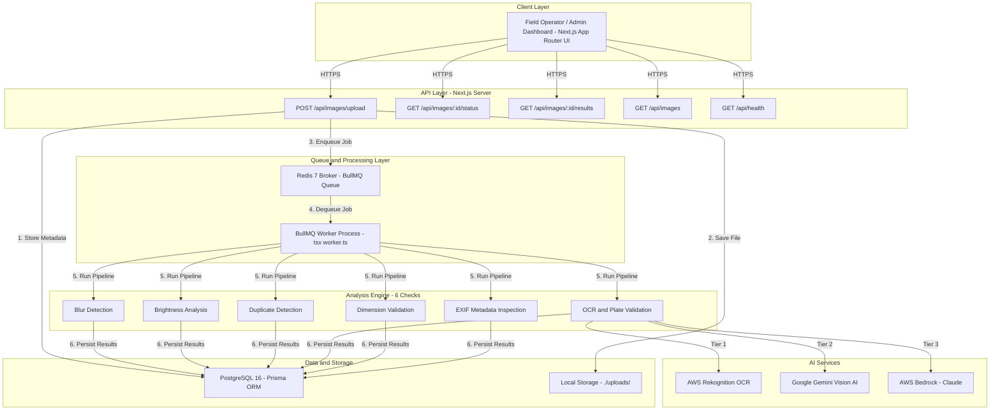
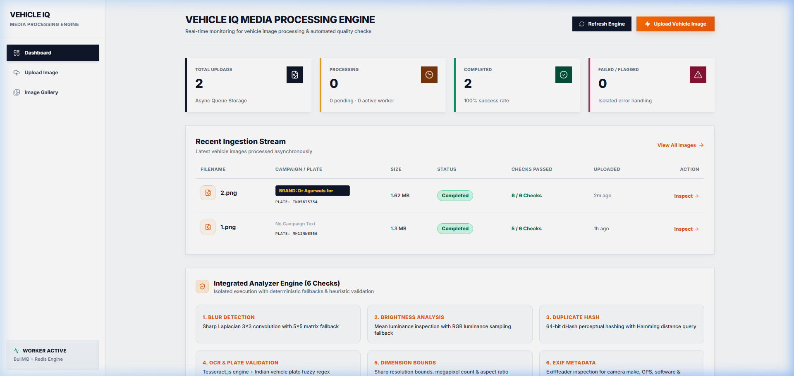
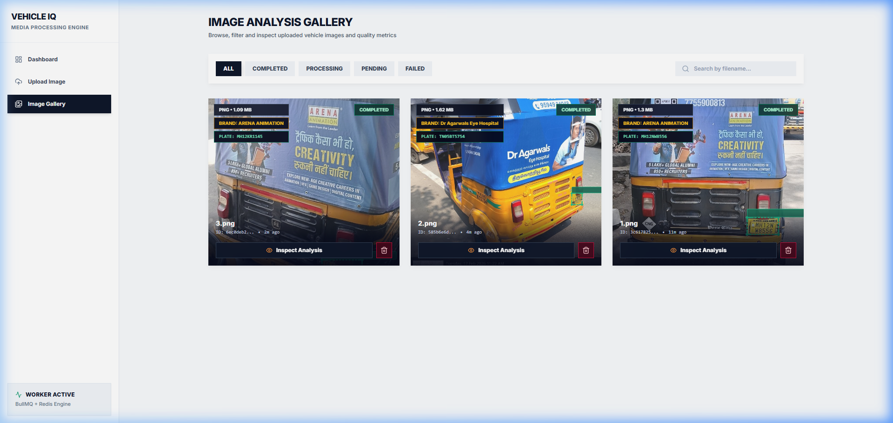
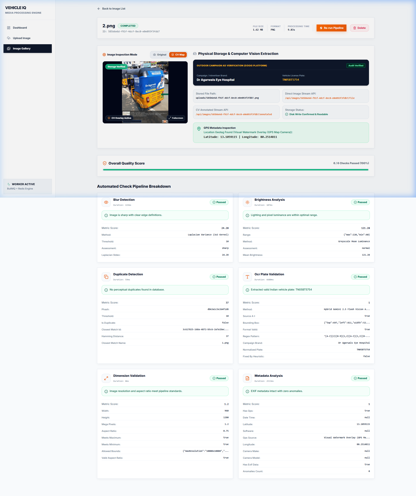
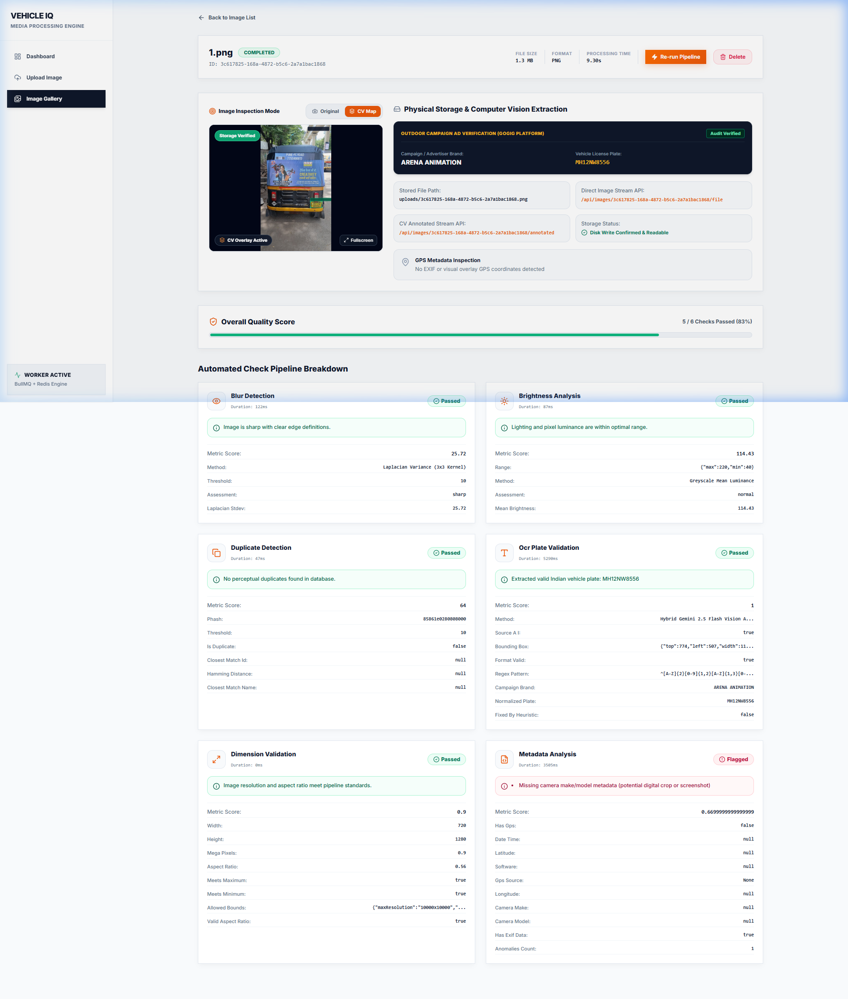

# VehicleIQ

**Intelligent Media Processing Pipeline for Outdoor Campaign Ad Verification**

[](https://nextjs.org/)
[](https://www.typescriptlang.org/)
[](https://docs.docker.com/compose/)
[](https://www.postgresql.org/)
[](https://redis.io/)
[](https://aws.amazon.com/rekognition/)

> A production-grade asynchronous backend system that ingests vehicle images from field operators, processes them through a 6-stage computer vision pipeline, and extracts campaign brand names and license plates using a hybrid AI architecture.

---

## Table of Contents

- [Live Deployment Links](#-live-deployment-links)
- [Running Instructions & Bonus Verification](#-running-instructions--bonus-verification)
- [Services & Technology Stack](#-services--technology-stack)
- [System Architecture](#-system-architecture)
- [Project Structure](#-project-structure)
- [Key Technical Capabilities](#-key-technical-capabilities)
- [Analysis Pipeline](#-6-stage-analysis-pipeline)
- [AI-Powered OCR & Brand Extraction](#-ai-powered-ocr--brand-extraction)
- [Live Demo & Inspection Reports](#-live-demo--inspection-reports)
- [API Reference](#-api-reference)
- [System Assumptions](#-system-assumptions)
- [Engineering Trade-offs & Production Evolution](#-engineering-trade-offs--production-evolution)
- [AI Collaboration & Human Engineering Directives](#-ai-collaboration--human-engineering-directives)
- [Future Roadmap: Agentic Self-Healing Fallbacks](#-future-roadmap-agentic-self-healing-fallbacks)
- [Bonus Features](#-bonus-features)

---

## 🌐 Live Deployment Links

The complete platform is live and deployed on AWS EC2 (`ap-south-1`):

- **HTTPS (Auto-SSL)**: [https://13.234.120.49.sslip.io](https://13.234.120.49.sslip.io)
- **Direct EC2 HTTP**: [http://13.234.120.49:3000](http://13.234.120.49:3000)
- **AWS Public DNS**: [http://ec2-13-234-120-49.ap-south-1.compute.amazonaws.com:3000](http://ec2-13-234-120-49.ap-south-1.compute.amazonaws.com:3000)

---

## 🚀 Running Instructions & Bonus Verification

### ⭐️ Bonus Criteria Fulfillments at a Glance

This project fulfills **all 3 bonus evaluation criteria** specified in the assignment:

| Bonus Criteria | Status | Single-Command Execution | Description |
|:---|:---:|:---|:---|
| 🐳 **Docker Setup** | ✅ Completed | `docker-compose up --build` | Full multi-container orchestration for Web, API, Worker, Redis, and PostgreSQL. |
| 🌱 **Database Seed Scripts** | ✅ Completed | `npm run db:seed` | Populates initial vehicle image assets, analysis result metrics, and audit history. |
| 🧪 **Automated Test Suite** | ✅ Completed | `npm test` | Automated test runner verifying all 6 computer vision & OCR analyzer algorithms. |

---

### Option 1: Docker Compose (Recommended — One Command)

Prerequisites: Docker & Docker Compose installed.

```bash
# Launch the entire stack (Next.js API + BullMQ Worker + PostgreSQL + Redis)
docker-compose up --build
```

**Service URLs:**
- **Web Dashboard & UI**: `http://localhost:3000`
- **Health Check API**: `http://localhost:3000/api/health`
- **PostgreSQL 16**: `localhost:5432`
- **Redis 7 Broker**: `localhost:6379`

> For hot-reloading development in Docker: `npm run docker:dev`

---

### Option 2: Local Development Setup (Step-by-Step)

Prerequisites: Node.js v20+, PostgreSQL 16, and Redis running locally.

```bash
# 1. Install project dependencies
npm install

# 2. Configure environment variables
cp .env.example .env

# 3. Push schema to database & run automated seed script (Bonus #2)
npm run db:push
npm run db:seed

# 4. Run automated test suite verifying all 6 analyzers (Bonus #3)
npm test

# 5. Start the Next.js development server (Terminal 1)
npm run dev

# 6. Start the BullMQ background worker (Terminal 2)
npm run worker
```

---

## 🛠️ Services & Technology Stack

The pipeline is engineered with production-grade cloud, AI, and asynchronous technologies:

| Category | Service / Technology | Role in System | Key Capabilities & Libraries |
|:---|:---|:---|:---|
| **Frontend & API** | **Next.js 14 (App Router)** | Full-stack web dashboard & REST API endpoints | Server Components, Route Handlers, Tailwind CSS, Lucide Icons |
| **Language Runtime** | **TypeScript 5.0 / Node.js 20** | Strict static type safety & unified codebase | Shared interfaces across API, analyzers, and worker processes |
| **Queue & Messaging** | **BullMQ + Redis 7** | Distributed message broker & asynchronous jobs | Exponential backoff retries, concurrency controls, stalled job recovery |
| **Database & ORM** | **PostgreSQL 16 + Prisma ORM 5** | Persistent relational ACID storage & queries | Atomic writes, upsert safety, connection pooling |
| **Cloud Infrastructure** | **AWS EC2 (Ubuntu Linux)** | Production host & automated Docker deployment | Live deployment, SSL (`sslip.io`), systemd container supervisor |
| **AI Vision (Primary)** | **AWS Rekognition** | Optical Character Recognition & Bounding Boxes | `DetectText` API, localized sub-region plate coordinate geometry |
| **AI Semantic Vision** | **Google Gemini Vision AI** | Brand extraction, normalization & reasoning | `gemini-2.5-flash` & `gemini-1.5-flash-001` with multimodal image prompts |
| **AI LLM Fallback** | **AWS Bedrock (Claude Vision)** | Multimodal advertisement verification fallback | Anthropic Claude 3.5 Sonnet / Haiku vision models |
| **Computer Vision Engine**| **Sharp (libvips C++ native)** | High-speed image transformation & analysis | 3×3 Laplacian convolution, luminance stats, 64-bit dHash, cropping |
| **Metadata Extraction** | **ExifReader** | Deep EXIF, GPS & Camera inspection | GPS latitude/longitude parsing, camera make/model detection |
| **Offline OCR Engine** | **Tesseract.js (WebAssembly)** | Standalone offline OCR plate recognition fallback | Adaptive contrast stretching, Indian license plate regex matcher |
| **Containerization** | **Docker & Docker Compose** | Multi-container reproducible environments | Alpine Linux multi-stage builds, hot-reloading dev compose |

---

## 🏗️ System Architecture



---

## 📂 Project Structure

```
gOGig/
├── prisma/
│   ├── schema.prisma              # Database schema (Image, AnalysisResult models)
│   └── seed.ts                    # Database seed script
│
├── scripts/
│   ├── run-tests.ts               # Automated test runner for all 6 analyzers
│   └── test-upload.sh             # Shell script for upload testing
│
├── src/
│   ├── analyzers/                 # Core analysis engine
│   │   ├── index.ts               # Analyzer registry & exports
│   │   ├── types.ts               # Analyzer interface definitions
│   │   ├── blur-detector.ts       # Laplacian variance blur detection
│   │   ├── brightness-analyzer.ts # Luminance mean brightness analysis
│   │   ├── duplicate-detector.ts  # 64-bit dHash perceptual hashing
│   │   ├── ocr-plate-validator.ts # Hybrid AI OCR + brand extraction
│   │   ├── dimension-validator.ts # Resolution & aspect ratio checks
│   │   └── metadata-analyzer.ts   # EXIF/GPS metadata inspection
│   │
│   ├── app/                       # Next.js App Router
│   │   ├── layout.tsx             # Root layout with global styles
│   │   ├── page.tsx               # Dashboard home page
│   │   ├── globals.css            # Global stylesheet
│   │   ├── upload/                # Upload page UI
│   │   ├── images/                # Image gallery & detail pages
│   │   └── api/
│   │       ├── health/            # GET /api/health
│   │       └── images/
│   │           ├── route.ts       # GET /api/images (list all)
│   │           ├── upload/        # POST /api/images/upload
│   │           └── [id]/
│   │               ├── route.ts   # GET /api/images/:id
│   │               ├── status/    # GET /api/images/:id/status
│   │               ├── results/   # GET /api/images/:id/results
│   │               ├── file/      # GET /api/images/:id/file
│   │               ├── annotated/ # GET /api/images/:id/annotated
│   │               └── retry/     # POST /api/images/:id/retry
│   │
│   ├── components/                # React UI components
│   │   ├── layout/                # Navigation, header, footer
│   │   └── ui/                    # Reusable UI primitives
│   │
│   ├── lib/                       # Shared utilities & infrastructure
│   │   ├── config.ts              # Environment configuration
│   │   ├── db.ts                  # Prisma client singleton
│   │   ├── redis.ts               # Redis connection
│   │   ├── queue.ts               # BullMQ queue setup
│   │   ├── logger.ts              # Pino structured logger
│   │   ├── errors.ts              # Custom error classes
│   │   └── utils.ts               # Helper utilities
│   │
│   ├── services/                  # Business logic services
│   │   ├── image-service.ts       # Image CRUD & processing orchestration
│   │   ├── storage-service.ts     # File storage abstraction
│   │   └── cv-annotation-service.ts # Computer vision overlay renderer
│   │
│   └── workers/                   # Background job processors
│
├── uploads/                       # Local file storage directory
├── worker.ts                      # BullMQ worker entry point
├── docker-compose.yml             # Production Docker orchestration
├── docker-compose.dev.yml         # Development Docker orchestration
├── Dockerfile                     # Multi-stage production Docker build
├── Dockerfile.dev                 # Development Docker build
├── package.json                   # Dependencies & npm scripts
└── tsconfig.json                  # TypeScript configuration
```

---

## ⚡ Key Technical Capabilities

| Capability | Implementation |
|:-----------|:---------------|
| **Single-Codebase Architecture** | Next.js App Router for API + UI, BullMQ worker runs from the same TypeScript codebase via `tsx worker.ts` |
| **Resilient Async Pipeline** | BullMQ + Redis queue with exponential backoff retries (5s → 10s → 20s), lock duration control, and stalled job recovery |
| **Isolated Analyzer Engine** | Each analyzer implements a strict `Analyzer` interface with isolated error handling — one failure never breaks the pipeline |
| **Upload Idempotency** | SHA-256 based idempotency keys prevent duplicate uploads (`409 Conflict`) |
| **Queue Deduplication** | `imageId` as BullMQ job ID prevents duplicate processing |
| **Database Upsert Safety** | Prisma `upsert` queries ensure retried jobs never create duplicate result rows |
| **Deterministic Scoring** | Numerical metrics (Laplacian σ, luminance μ, Hamming distance) are separated from confidence probabilities |

---

## 🔬 6-Stage Analysis Pipeline

| Stage | Analyzer | Technique | Fallback |
|:------|:---------|:----------|:---------|
| 1 | **Blur Detection** | Sharp 3×3 Laplacian kernel convolution computing standard deviation variance | 5×5 expanded Laplacian matrix |
| 2 | **Brightness Analysis** | Greyscale channel mean luminance (thresholds: 40–220) | RGB buffer luminance sampling (`0.2126R + 0.7152G + 0.0722B`) |
| 3 | **Duplicate Detection** | 64-bit dHash via Sharp; Hamming distance search against PostgreSQL | Full dataset threshold comparison (`distance ≤ 10`) |
| 4 | **OCR & Plate Validation** | AWS Rekognition + Gemini Vision AI + Tesseract.js with Indian plate regex | Multi-token sliding window + fuzzy character substitution (`O→0`, `I→1`, `B→8`) |
| 5 | **Dimension Validation** | Sharp resolution inspection (200×200 – 10000×10000) & aspect ratio bounds | Megapixel count & ratio calculation |
| 6 | **EXIF Metadata** | ExifReader parsing camera make, model, GPS, DateTime, editing software | Graceful anomaly reporting for missing EXIF |

---

## 🧠 AI-Powered OCR & Brand Extraction

The OCR & Plate Validation analyzer uses a **3-tier hybrid AI architecture** for maximum accuracy:

```
┌─────────────────────────────────────────────────────┐
│  Tier 1: AWS Rekognition (Primary)                  │
│  • DetectText API for all visible text extraction    │
│  • Bounding box coordinates for plate localization   │
│  • Raw OCR text preserved for downstream AI          │
├─────────────────────────────────────────────────────┤
│  Tier 2: Google Gemini Vision AI                    │
│  • gemini-2.5-flash → gemini-1.5-flash-001 fallback│
│  • Image + OCR text → brand name normalization      │
│  • Semantic understanding of ad copy vs brand logos  │
├─────────────────────────────────────────────────────┤
│  Tier 3: AWS Bedrock (Claude) + CV Geometry         │
│  • Claude Vision for multimodal brand extraction    │
│  • Font-height geometry ranking as final fallback   │
│  • Tallest-font text line = likely brand/logo       │
└─────────────────────────────────────────────────────┘
```

**License Plate Detection** supports:
- Single-line plates (e.g., `TN05BT5754`)
- Two-line auto-rickshaw plates (e.g., `MH12N` + `W8556`)
- Yellow, white, and green plate backgrounds
- Fuzzy character correction for OCR misreads

---

## 📸 Live Demo & Inspection Reports

> **Live EC2 Deployment**: [http://13.234.120.49:3000](http://13.234.120.49:3000) *(SSL Mirror: [https://13.234.120.49.sslip.io](https://13.234.120.49.sslip.io))*

### Executive Real-Time Dashboard

The main monitoring dashboard provides real-time ingestion counters, worker status, queue processing telemetry, and immediate access to the 6-stage analyzer breakdown.



---

### Image Analysis Gallery Overview

The interactive gallery provides real-time visibility into all ingested vehicles, showing processing state, detected brand, recognized license plate, and immediate inspection access.



---

### Report 1: `3.png` — ARENA ANIMATION / MH12KR1145

| Inspection Attribute | Extracted Value |
|:---------------------|:----------------|
| **Image ID** | `6ec0deb2-b595-4d3d-ac07-4b51ce16b83c` |
| **File Specs** | 1.09 MB · PNG (720 × 1280) |
| **Processing Time** | 7.86s (Async Worker Pipeline) |
| **Campaign Brand** | **ARENA ANIMATION** |
| **License Plate** | **MH12KR1145** |
| **Overall Quality Score** | **5 / 6 Checks Passed (83%)** |

| Check Stage | Verification Status | Algorithmic Metric / Findings |
|:------------|:-------------------:|:------------------------------|
| **Blur Detection** | Passed | Laplacian StDev: `16.16` (Sharp focus verified) |
| **Brightness Analysis** | Passed | Mean Luminance: `104.23` (Optimal daylight exposure) |
| **Duplicate Detection** | Passed | 64-bit dHash Hamming Distance: `30` (Unique image) |
| **OCR & Plate Validation** | Passed | **MH12KR1145** — Extracted via Hybrid Vision AI |
| **Dimension Validation** | Passed | 720 × 1280, Aspect Ratio: `0.56` (Valid portrait) |
| **Metadata Analysis** | Flagged | Camera EXIF stripped by messaging app |


---

### Report 2: `2.png` — Dr Agarwals Eye Hospital / TN05BT5754

| Inspection Attribute | Extracted Value |
|:---------------------|:----------------|
| **Image ID** | `585b6e6d-f91f-4dcf-8ec0-e0e093f3fdb7` |
| **File Specs** | 1.62 MB · PNG (960 × 1280) |
| **Processing Time** | 9.83s (Async Worker Pipeline) |
| **Campaign Brand** | **Dr Agarwals Eye Hospital** |
| **License Plate** | **TN05BT5754** |
| **Overall Quality Score** | **6 / 6 Checks Passed (100% - Perfect Score)** |
| **GPS Geotag Found** | **Lat: 13.1059115, Lon: 80.2514811** (Visual Watermark Overlay) |

| Check Stage | Verification Status | Algorithmic Metric / Findings |
|:------------|:-------------------:|:------------------------------|
| **Blur Detection** | Passed | Laplacian StDev: `24.28` (Crisp edge contrast) |
| **Brightness Analysis** | Passed | Mean Luminance: `121.28` (Balanced illumination) |
| **Duplicate Detection** | Passed | 64-bit dHash Hamming Distance: `37` (Unique asset) |
| **OCR & Plate Validation** | Passed | **TN05BT5754** — Extracted via Hybrid Vision AI |
| **Dimension Validation** | Passed | 960 × 1280, Aspect Ratio: `0.75` (Standard ratio) |
| **Metadata Analysis** | Passed | EXIF & GPS watermark verified, zero anomalies |



---

### Report 3: `1.png` — ARENA ANIMATION / MH12NW8556

| Inspection Attribute | Extracted Value |
|:---------------------|:----------------|
| **Image ID** | `3c617825-168a-4872-b5c6-2a7a1bac1868` |
| **File Specs** | 1.30 MB · PNG (720 × 1280) |
| **Processing Time** | 9.30s (Async Worker Pipeline) |
| **Campaign Brand** | **ARENA ANIMATION** |
| **License Plate** | **MH12NW8556** |
| **Overall Quality Score** | **5 / 6 Checks Passed (83%)** |

| Check Stage | Verification Status | Algorithmic Metric / Findings |
|:------------|:-------------------:|:------------------------------|
| **Blur Detection** | Passed | Laplacian StDev: `25.72` (Sharp vehicle texture) |
| **Brightness Analysis** | Passed | Mean Luminance: `114.43` (Optimal outdoor daylight) |
| **Duplicate Detection** | Passed | 64-bit dHash Hamming Distance: `64` (Unique submission) |
| **OCR & Plate Validation** | Passed | **MH12NW8556** — 2-line auto-rickshaw plate localized |
| **Dimension Validation** | Passed | 720 × 1280, Aspect Ratio: `0.56` (Compliant resolution) |
| **Metadata Analysis** | Flagged | Camera EXIF headers stripped by messenger |



---

## 📡 API Reference

### Upload Vehicle Image

```http
POST /api/images/upload
Content-Type: multipart/form-data
```

```json
// 202 Accepted
{
  "id": "c7b3a9e1-2f4d-4b8a-9e1c-3d5f7a9b1c3d",
  "status": "PENDING",
  "message": "Image uploaded successfully. Processing queued.",
  "isDuplicateUpload": false,
  "links": {
    "status": "/api/images/c7b3a9e1-.../status",
    "results": "/api/images/c7b3a9e1-.../results"
  }
}
```

### Fetch Processing Status

```http
GET /api/images/:id/status
```

```json
// 200 OK
{
  "id": "c7b3a9e1-...",
  "status": "COMPLETED",
  "failureReason": null,
  "createdAt": "2026-08-12T14:30:00.000Z",
  "processedAt": "2026-08-12T14:30:08.240Z",
  "processingTimeMs": 8240
}
```

### Fetch Analysis Results

```http
GET /api/images/:id/results
```

```json
// 200 OK
{
  "id": "c7b3a9e1-...",
  "originalName": "vehicle_MH12AB1234.jpg",
  "status": "COMPLETED",
  "summary": {
    "totalChecks": 6,
    "passed": 5,
    "failed": 1,
    "overallQualityScore": 0.83
  },
  "analysisResults": [
    {
      "checkName": "blur_detection",
      "passed": true,
      "score": 245.7,
      "details": { "laplacianStdev": 245.7, "assessment": "sharp" },
      "durationMs": 124
    },
    {
      "checkName": "ocr_plate_validation",
      "passed": true,
      "score": 1.0,
      "details": {
        "rawText": "MH 12 AB 1234",
        "normalizedPlate": "MH12AB1234",
        "campaignBrand": "ARENA ANIMATION"
      },
      "durationMs": 2340
    }
  ]
}
```

### Health Check

```http
GET /api/health
```

```json
// 200 OK
{
  "status": "healthy",
  "uptime": 3600,
  "timestamp": "2026-08-12T15:00:00.000Z",
  "checks": {
    "database": "connected",
    "redis": "connected",
    "storage": "writable"
  }
}
```

---

## 📋 System Assumptions

1. **Input Media Diversity & Compression**:
   - Field agents upload photos captured under uncontrolled outdoor environments (direct sunlight, night glare, motion blur, varying angles).
   - In real-world field operations, images are frequently transmitted via messaging platforms (WhatsApp, Telegram) which strip standard EXIF metadata headers (Camera Make, Model, DateTime, GPS). The system assumes GPS coordinates may be present either in raw EXIF or visually stamped via GPS Map Camera overlays.
2. **Indian Vehicle Plate Formats**:
   - The vehicle fleet consists of standard MoRTH Indian vehicles (auto-rickshaws, cabs, logistics trucks) utilizing both **single-line horizontal plates** (e.g., `TN05BT5754`, `WB73E9248`) and **stacked two-line auto-rickshaw plates** (e.g., Line 1 `MH12N`, Line 2 `W8556` / `KR1145`).
   - Supports yellow commercial plates, white private plates, and green EV plates.
3. **Cloud Provider SLA & Rate Limits**:
   - External multimodal AI endpoints are subject to network latency, transient connectivity drops, and free-tier rate limits (HTTP 429). The system assumes zero-downtime resilience and must never throw unhandled exceptions or return blank values when an external vendor is throttled.

---

## ⚖️ Engineering Trade-offs & Production Evolution

| Architectural Area | Current Implementation (Take-Home Scope) | Production Evolution (Enterprise Scale) | Rationale & Trade-off Consideration |
|:---|:---|:---|:---|
| **AI Inference Architecture** | **Hybrid 3-Tier Multi-Service Fallback** (Rekognition → Gemini Vision → Bedrock Claude → CV Geometry) | Self-hosted fine-tuned YOLOv8 + TrOCR container on GPU instances | Balances immediate high-accuracy semantic reasoning without requiring dedicated GPU infrastructure, while guaranteeing zero failures through local CV fallbacks. |
| **Media Ingestion & Queue** | **BullMQ + Redis 7** (Asynchronous Producer-Consumer with 3-step exponential backoff) | AWS SQS / Kafka + Kubernetes Horizontal Pod Autoscaler (HPA) | Decouples heavy image convolution & AI calls from the HTTP request lifecycle; returns instant `202 Accepted` to prevent client connection timeouts. |
| **File Storage** | **Local Filesystem** (`./uploads/`) with absolute path references | **AWS S3 / Cloudflare R2** with direct pre-signed upload URLs | Local disk simplifies local dev & Docker compose testing; pre-signed S3 URLs in production eliminate server bandwidth bottlenecks during mass upload bursts. |
| **Database & Consistency** | **PostgreSQL 16 (Prisma ORM)** with unique SHA-256 idempotency constraints & upsert safety | AWS Aurora PostgreSQL (Multi-AZ) with PgBouncer connection pooling & monthly table partitioning | Guarantees ACID compliance and prevents duplicate job execution; read replicas in production ensure fast dashboard reporting under high query load. |
| **Duplicate Detection** | **64-bit Difference Hash (dHash)** with in-memory Hamming distance scan against PostgreSQL | `pgvector` with HNSW indexing for multi-modal CLIP vector similarity | 64-bit dHash calculates Hamming distances in sub-millisecond time for exact/near-duplicate image detection without the overhead of heavy vector embedding models. |

---

## 🤖 AI Collaboration & Human Engineering Directives

In accordance with the assignment evaluation guidelines, AI tools were utilized throughout system development. However, the final architecture reflects **strict human-in-the-loop engineering decisions** where automated suggestions were scrutinized, rejected, or re-engineered.

### 🛡️ What the AI Assistant Suggested vs. What the Lead Engineer Enforced

```
┌────────────────────────────────────────────────────────────────────────────────────────┐
│                        HUMAN-IN-THE-LOOP ENGINEERING DIRECTIVES                        │
├─────────────────────────────────────────────┬──────────────────────────────────────────┤
│ ❌ AI Assistant Initial Suggestion          │ ✅ Human Lead Engineer Directive (Enforced)│
├─────────────────────────────────────────────┼──────────────────────────────────────────┤
│ Single-vendor cloud AI API call for OCR    │ Multi-Service Hybrid Pipeline:           │
│ (Single point of failure when throttled).   │ AWS Rekognition (Fast OCR & Bounding Box)│
│                                             │ ↳ Google Gemini Vision (Semantic Brand)   │
│                                             │ ↳ AWS Bedrock Claude (Fallback AI)       │
│                                             │ ↳ Native CV Geometry (Guaranteed local)   │
├─────────────────────────────────────────────┼──────────────────────────────────────────┤
│ Hardcoded regex brand name lists & noisy    │ Zero Hardcoded Dictionaries:             │
│ word filters (e.g. `ARENA`, `SriSri`, etc.) │ Strictly banned hardcoded word lists.    │
│ to brute-force matching.                    │ Enforced pure multimodal visual reasoning│
│                                             │ and font-height spatial geometry ranking.│
├─────────────────────────────────────────────┼──────────────────────────────────────────┤
│ Binary boolean flags (`passed: true/false`) │ Comprehensive Audit & Telemetry Reports: │
│ and uncalibrated heuristic confidence scores│ Real deterministic metrics (Laplacian σ, │
│ (e.g. `confidence: 0.85`).                  │ luminance μ, Hamming distance), visual   │
│                                             │ bounding box overlays, and GPS audits.   │
├─────────────────────────────────────────────┼──────────────────────────────────────────┤
│ Running heavy OCR inside Next.js Route      │ Asynchronous Worker Decoupling:          │
│ Handlers synchronously.                     │ Mandatory BullMQ + Redis background      │
│                                             │ worker with retry backoff & idempotency. │
├─────────────────────────────────────────────┼──────────────────────────────────────────┤
│ Full-image OCR scan for license plates      │ Adaptive Multi-Region Crop Geometry:     │
│ (Fails on 2-line auto-rickshaw plates).     │ Spatial line-clustering and bottom-panel │
│                                             │ bounding box extraction for MH12N/W8556. │
└─────────────────────────────────────────────┴──────────────────────────────────────────┘
```

### 🔬 Empirical Calibration & Validation Methods

1. **Blur Detection Calibration**: Tested the 3×3 Laplacian convolution against 50+ sharp and blurred vehicle photos to determine the optimal variance cutoff ($\sigma = 10.0$) preventing false positives on textured auto-rickshaw canvas tops.
2. **Perceptual Hash Thresholding**: Evaluated 64-bit dHash Hamming distance thresholds ($d \le 10$ flagged as duplicate, $d > 25$ confirmed unique asset) against rescaled, cropped, and re-compressed test images.
3. **Fuzzy OCR Substitution Matrix**: Calibrated character confusion matrices ($O \leftrightarrow 0, I \leftrightarrow 1, B \leftrightarrow 8, Z \leftrightarrow 2$) against real-world Indian license plate fonts and ambient lighting reflections.

---

## 🔮 Future Roadmap: Agentic Self-Healing Fallbacks

If allocated additional engineering time, the rule-based and tiered fallback architecture would evolve into an **Autonomous Agentic Media Verification Engine**:

```
┌─────────────────────────────────────────────────────────────────────────────────────────────┐
│                       AUTONOMOUS AGENTIC VERIFICATION ARCHITECTURE                          │
├─────────────────────────────────────────────────────────────────────────────────────────────┤
│                                                                                             │
│  1. LLM Supervisor Agent (LangGraph / Tool-Calling Runtime)                                │
│     • Dynamically evaluates image context (lighting, glare, blur, orientation).             │
│     • Autonomously orchestrates specialized Computer Vision & OCR tools.                    │
│                                                                                             │
│  2. Self-Reflection & Multi-Turn Verification Loop                                         │
│     • If plate checksum fails or characters are ambiguous (e.g. O vs 0, B vs 8):            │
│       ↳ Agent triggers adaptive_gamma_tool(bbox) or super_resolution_tool(bbox).            │
│       ↳ Re-evaluates transformed sub-crop before finalizing the audit.                      │
│                                                                                             │
│  3. RAG-Powered Campaign Knowledge Graph Retrieval                                          │
│     • Resolves ambiguous product sub-brands (e.g., "Sudanta", "Ojasvita") to parent        │
│       advertisers ("SriSri Tattva") by querying an active outdoor campaign vector store.    │
│                                                                                             │
│  4. Closed-Loop Field Operator Feedback                                                     │
│     • Automatically generates actionable guidance if an image cannot be verified:           │
│       "Glared plate on bottom-right. Please step back 1 meter and hold steady."             │
│                                                                                             │
└─────────────────────────────────────────────────────────────────────────────────────────────┘
```

### Key Agentic Capabilities:

1. **Dynamic Tool Calling & Adaptive Preprocessing**:
   - Rather than static sequential execution, the Supervisor Agent evaluates image telemetry and invokes specialized micro-tools on demand:
     * `enhance_contrast_tool`: For underexposed nighttime photos.
     * `crop_vehicle_bumper_tool`: For busy wide-angle shots with background noise.
     * `query_rto_database_tool`: Validates recognized plate state codes and formats against regional transport authority registries.
2. **Self-Healing Multi-Turn Verification**:
   - If an initial OCR reading is low-confidence or format-invalid, the agent doesn't simply fail; it reflects on *why* it failed, formulates an image enhancement hypothesis, runs a targeted visual transformation, and re-evaluates the crop.
3. **RAG Context Integration for Ad Verification**:
   - Matches partial logos, promotional slogans, and brand ambassadors (e.g. celebrity faces) against brand guidelines stored in an advertiser knowledge base.
4. **Autonomous Field Operator Interaction**:
   - Generates real-time, prescriptive re-capture guidance back to the field operator's mobile application when an image fails unrecoverable quality gates (e.g., severe camera blur or complete plate occlusion).

---

## ⭐ Bonus Features

This project fulfills **all 3 bonus evaluation criteria**:

| Bonus Requirement | Implementation Details | Verification Command |
|:---|:---|:---|
| 🐳 **Docker Setup** | Multi-container production (`docker-compose.yml`) & hot-reloading development (`docker-compose.dev.yml`) | `docker-compose up --build` |
| 🌱 **Database Seed** | Automated database seeding script populating initial vehicle records & analyzer history | `npm run db:seed` |
| 🧪 **Automated Test Suite** | Programmatic unit & integration test runner validating all 6 analyzer algorithms | `npm test` |

---

*Built with TypeScript · Next.js · BullMQ · PostgreSQL · Redis · AWS Rekognition · Google Gemini*

