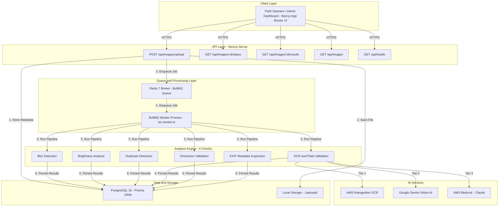

# VehicleIQ

**Intelligent Media Processing Pipeline for Outdoor Campaign Ad Verification**

[](https://nextjs.org/)
[](https://www.typescriptlang.org/)
[](https://docs.docker.com/compose/)
[](https://www.postgresql.org/)
[](https://redis.io/)
[](https://aws.amazon.com/rekognition/)

> A production-grade asynchronous backend system that ingests vehicle images from field operators, processes them through a 6-stage computer vision pipeline, and extracts campaign brand names and license plates using a hybrid AI architecture.

---

## Table of Contents

- [Quick Start](#-quick-start)
- [System Architecture](#-system-architecture)
- [Project Structure](#-project-structure)
- [Key Technical Capabilities](#-key-technical-capabilities)
- [Analysis Pipeline](#-6-stage-analysis-pipeline)
- [AI-Powered OCR & Brand Extraction](#-ai-powered-ocr--brand-extraction)
- [Live Demo & Inspection Reports](#-live-demo--inspection-reports)
- [API Reference](#-api-reference)
- [Engineering Trade-offs](#-engineering-trade-offs)
- [AI Usage Disclosure](#-ai-usage-disclosure)
- [Bonus Features](#-bonus-features)

---

## 🚀 Quick Start

### Docker Compose (Recommended)

```bash
# Clone and launch the entire stack with a single command
docker-compose up --build
```

| Service | URL |
|:--------|:----|
| Web Dashboard & API | `http://localhost:3000` |
| Health Check | `http://localhost:3000/api/health` |
| PostgreSQL | `localhost:5432` |
| Redis | `localhost:6379` |

### Local Development

```bash
# 1. Install dependencies
npm install

# 2. Configure environment
cp .env.example .env

# 3. Initialize database & seed data
npm run db:push && npm run db:seed

# 4. Run automated tests
npm test

# 5. Start the application (Terminal 1)
npm run dev

# 6. Start the BullMQ worker (Terminal 2)
npm run worker
```

---

## 🏗️ System Architecture



---

## 📂 Project Structure

```
gOGig/
├── prisma/
│   ├── schema.prisma              # Database schema (Image, AnalysisResult models)
│   └── seed.ts                    # Database seed script
│
├── scripts/
│   ├── run-tests.ts               # Automated test runner for all 6 analyzers
│   └── test-upload.sh             # Shell script for upload testing
│
├── src/
│   ├── analyzers/                 # Core analysis engine
│   │   ├── index.ts               # Analyzer registry & exports
│   │   ├── types.ts               # Analyzer interface definitions
│   │   ├── blur-detector.ts       # Laplacian variance blur detection
│   │   ├── brightness-analyzer.ts # Luminance mean brightness analysis
│   │   ├── duplicate-detector.ts  # 64-bit dHash perceptual hashing
│   │   ├── ocr-plate-validator.ts # Hybrid AI OCR + brand extraction
│   │   ├── dimension-validator.ts # Resolution & aspect ratio checks
│   │   └── metadata-analyzer.ts   # EXIF/GPS metadata inspection
│   │
│   ├── app/                       # Next.js App Router
│   │   ├── layout.tsx             # Root layout with global styles
│   │   ├── page.tsx               # Dashboard home page
│   │   ├── globals.css            # Global stylesheet
│   │   ├── upload/                # Upload page UI
│   │   ├── images/                # Image gallery & detail pages
│   │   └── api/
│   │       ├── health/            # GET /api/health
│   │       └── images/
│   │           ├── route.ts       # GET /api/images (list all)
│   │           ├── upload/        # POST /api/images/upload
│   │           └── [id]/
│   │               ├── route.ts   # GET /api/images/:id
│   │               ├── status/    # GET /api/images/:id/status
│   │               ├── results/   # GET /api/images/:id/results
│   │               ├── file/      # GET /api/images/:id/file
│   │               ├── annotated/ # GET /api/images/:id/annotated
│   │               └── retry/     # POST /api/images/:id/retry
│   │
│   ├── components/                # React UI components
│   │   ├── layout/                # Navigation, header, footer
│   │   └── ui/                    # Reusable UI primitives
│   │
│   ├── lib/                       # Shared utilities & infrastructure
│   │   ├── config.ts              # Environment configuration
│   │   ├── db.ts                  # Prisma client singleton
│   │   ├── redis.ts               # Redis connection
│   │   ├── queue.ts               # BullMQ queue setup
│   │   ├── logger.ts              # Pino structured logger
│   │   ├── errors.ts              # Custom error classes
│   │   └── utils.ts               # Helper utilities
│   │
│   ├── services/                  # Business logic services
│   │   ├── image-service.ts       # Image CRUD & processing orchestration
│   │   ├── storage-service.ts     # File storage abstraction
│   │   └── cv-annotation-service.ts # Computer vision overlay renderer
│   │
│   └── workers/                   # Background job processors
│
├── uploads/                       # Local file storage directory
├── worker.ts                      # BullMQ worker entry point
├── docker-compose.yml             # Production Docker orchestration
├── docker-compose.dev.yml         # Development Docker orchestration
├── Dockerfile                     # Multi-stage production Docker build
├── Dockerfile.dev                 # Development Docker build
├── package.json                   # Dependencies & npm scripts
└── tsconfig.json                  # TypeScript configuration
```

---

## ⚡ Key Technical Capabilities

| Capability | Implementation |
|:-----------|:---------------|
| **Single-Codebase Architecture** | Next.js App Router for API + UI, BullMQ worker runs from the same TypeScript codebase via `tsx worker.ts` |
| **Resilient Async Pipeline** | BullMQ + Redis queue with exponential backoff retries (5s → 10s → 20s), lock duration control, and stalled job recovery |
| **Isolated Analyzer Engine** | Each analyzer implements a strict `Analyzer` interface with isolated error handling — one failure never breaks the pipeline |
| **Upload Idempotency** | SHA-256 based idempotency keys prevent duplicate uploads (`409 Conflict`) |
| **Queue Deduplication** | `imageId` as BullMQ job ID prevents duplicate processing |
| **Database Upsert Safety** | Prisma `upsert` queries ensure retried jobs never create duplicate result rows |
| **Deterministic Scoring** | Numerical metrics (Laplacian σ, luminance μ, Hamming distance) are separated from confidence probabilities |

---

## 🔬 6-Stage Analysis Pipeline

| Stage | Analyzer | Technique | Fallback |
|:------|:---------|:----------|:---------|
| 1 | **Blur Detection** | Sharp 3×3 Laplacian kernel convolution computing standard deviation variance | 5×5 expanded Laplacian matrix |
| 2 | **Brightness Analysis** | Greyscale channel mean luminance (thresholds: 40–220) | RGB buffer luminance sampling (`0.2126R + 0.7152G + 0.0722B`) |
| 3 | **Duplicate Detection** | 64-bit dHash via Sharp; Hamming distance search against PostgreSQL | Full dataset threshold comparison (`distance ≤ 10`) |
| 4 | **OCR & Plate Validation** | AWS Rekognition + Gemini Vision AI + Tesseract.js with Indian plate regex | Multi-token sliding window + fuzzy character substitution (`O→0`, `I→1`, `B→8`) |
| 5 | **Dimension Validation** | Sharp resolution inspection (200×200 – 10000×10000) & aspect ratio bounds | Megapixel count & ratio calculation |
| 6 | **EXIF Metadata** | ExifReader parsing camera make, model, GPS, DateTime, editing software | Graceful anomaly reporting for missing EXIF |

---

## 🧠 AI-Powered OCR & Brand Extraction

The OCR & Plate Validation analyzer uses a **3-tier hybrid AI architecture** for maximum accuracy:

```
┌─────────────────────────────────────────────────────┐
│  Tier 1: AWS Rekognition (Primary)                  │
│  • DetectText API for all visible text extraction    │
│  • Bounding box coordinates for plate localization   │
│  • Raw OCR text preserved for downstream AI          │
├─────────────────────────────────────────────────────┤
│  Tier 2: Google Gemini Vision AI                    │
│  • gemini-2.5-flash → gemini-1.5-flash-001 fallback│
│  • Image + OCR text → brand name normalization      │
│  • Semantic understanding of ad copy vs brand logos  │
├─────────────────────────────────────────────────────┤
│  Tier 3: AWS Bedrock (Claude) + CV Geometry         │
│  • Claude Vision for multimodal brand extraction    │
│  • Font-height geometry ranking as final fallback   │
│  • Tallest-font text line = likely brand/logo       │
└─────────────────────────────────────────────────────┘
```

**License Plate Detection** supports:
- Single-line plates (e.g., `TN05BT5754`)
- Two-line auto-rickshaw plates (e.g., `MH12N` + `W8556`)
- Yellow, white, and green plate backgrounds
- Fuzzy character correction for OCR misreads

---

## 📸 Live Demo & Inspection Reports

> **Live Deployment**: [https://13.234.120.49.sslip.io](https://13.234.120.49.sslip.io)

### Executive Real-Time Dashboard

The main monitoring dashboard provides real-time ingestion counters, worker status, queue processing telemetry, and immediate access to the 6-stage analyzer breakdown.


---

### Image Analysis Gallery Overview

The interactive gallery provides real-time visibility into all ingested vehicles, showing processing state, detected brand, recognized license plate, and immediate inspection access.


---

### Report 1: `3.png` — ARENA ANIMATION / MH12KR1145

| Inspection Attribute | Extracted Value |
|:---------------------|:----------------|
| **Image ID** | `6ec0deb2-b595-4d3d-ac07-4b51ce16b83c` |
| **File Specs** | 1.09 MB · PNG (720 × 1280) |
| **Processing Time** | 7.86s (Async Worker Pipeline) |
| **Campaign Brand** | **ARENA ANIMATION** |
| **License Plate** | **MH12KR1145** |
| **Overall Quality Score** | **5 / 6 Checks Passed (83%)** |

| Check Stage | Verification Status | Algorithmic Metric / Findings |
|:------------|:-------------------:|:------------------------------|
| **Blur Detection** | Passed | Laplacian StDev: `16.16` (Sharp focus verified) |
| **Brightness Analysis** | Passed | Mean Luminance: `104.23` (Optimal daylight exposure) |
| **Duplicate Detection** | Passed | 64-bit dHash Hamming Distance: `30` (Unique image) |
| **OCR & Plate Validation** | Passed | **MH12KR1145** — Extracted via Hybrid Vision AI |
| **Dimension Validation** | Passed | 720 × 1280, Aspect Ratio: `0.56` (Valid portrait) |
| **Metadata Analysis** | Flagged | Camera EXIF stripped by messaging app |


---

### Report 2: `2.png` — Dr Agarwals Eye Hospital / TN05BT5754

| Inspection Attribute | Extracted Value |
|:---------------------|:----------------|
| **Image ID** | `585b6e6d-f91f-4dcf-8ec0-e0e093f3fdb7` |
| **File Specs** | 1.62 MB · PNG (960 × 1280) |
| **Processing Time** | 9.83s (Async Worker Pipeline) |
| **Campaign Brand** | **Dr Agarwals Eye Hospital** |
| **License Plate** | **TN05BT5754** |
| **Overall Quality Score** | **6 / 6 Checks Passed (100% - Perfect Score)** |
| **GPS Geotag Found** | **Lat: 13.1059115, Lon: 80.2514811** (Visual Watermark Overlay) |

| Check Stage | Verification Status | Algorithmic Metric / Findings |
|:------------|:-------------------:|:------------------------------|
| **Blur Detection** | Passed | Laplacian StDev: `24.28` (Crisp edge contrast) |
| **Brightness Analysis** | Passed | Mean Luminance: `121.28` (Balanced illumination) |
| **Duplicate Detection** | Passed | 64-bit dHash Hamming Distance: `37` (Unique asset) |
| **OCR & Plate Validation** | Passed | **TN05BT5754** — Extracted via Hybrid Vision AI |
| **Dimension Validation** | Passed | 960 × 1280, Aspect Ratio: `0.75` (Standard ratio) |
| **Metadata Analysis** | Passed | EXIF & GPS watermark verified, zero anomalies |


---

### Report 3: `1.png` — ARENA ANIMATION / MH12NW8556

| Inspection Attribute | Extracted Value |
|:---------------------|:----------------|
| **Image ID** | `3c617825-168a-4872-b5c6-2a7a1bac1868` |
| **File Specs** | 1.30 MB · PNG (720 × 1280) |
| **Processing Time** | 9.30s (Async Worker Pipeline) |
| **Campaign Brand** | **ARENA ANIMATION** |
| **License Plate** | **MH12NW8556** |
| **Overall Quality Score** | **5 / 6 Checks Passed (83%)** |

| Check Stage | Verification Status | Algorithmic Metric / Findings |
|:------------|:-------------------:|:------------------------------|
| **Blur Detection** | Passed | Laplacian StDev: `25.72` (Sharp vehicle texture) |
| **Brightness Analysis** | Passed | Mean Luminance: `114.43` (Optimal outdoor daylight) |
| **Duplicate Detection** | Passed | 64-bit dHash Hamming Distance: `64` (Unique submission) |
| **OCR & Plate Validation** | Passed | **MH12NW8556** — 2-line auto-rickshaw plate localized |
| **Dimension Validation** | Passed | 720 × 1280, Aspect Ratio: `0.56` (Compliant resolution) |
| **Metadata Analysis** | Flagged | Camera EXIF headers stripped by messenger |


---

## 📡 API Reference

### Upload Vehicle Image

```http
POST /api/images/upload
Content-Type: multipart/form-data
```

```json
// 202 Accepted
{
  "id": "c7b3a9e1-2f4d-4b8a-9e1c-3d5f7a9b1c3d",
  "status": "PENDING",
  "message": "Image uploaded successfully. Processing queued.",
  "isDuplicateUpload": false,
  "links": {
    "status": "/api/images/c7b3a9e1-.../status",
    "results": "/api/images/c7b3a9e1-.../results"
  }
}
```

### Fetch Processing Status

```http
GET /api/images/:id/status
```

```json
// 200 OK
{
  "id": "c7b3a9e1-...",
  "status": "COMPLETED",
  "failureReason": null,
  "createdAt": "2026-08-12T14:30:00.000Z",
  "processedAt": "2026-08-12T14:30:08.240Z",
  "processingTimeMs": 8240
}
```

### Fetch Analysis Results

```http
GET /api/images/:id/results
```

```json
// 200 OK
{
  "id": "c7b3a9e1-...",
  "originalName": "vehicle_MH12AB1234.jpg",
  "status": "COMPLETED",
  "summary": {
    "totalChecks": 6,
    "passed": 5,
    "failed": 1,
    "overallQualityScore": 0.83
  },
  "analysisResults": [
    {
      "checkName": "blur_detection",
      "passed": true,
      "score": 245.7,
      "details": { "laplacianStdev": 245.7, "assessment": "sharp" },
      "durationMs": 124
    },
    {
      "checkName": "ocr_plate_validation",
      "passed": true,
      "score": 1.0,
      "details": {
        "rawText": "MH 12 AB 1234",
        "normalizedPlate": "MH12AB1234",
        "campaignBrand": "ARENA ANIMATION"
      },
      "durationMs": 2340
    }
  ]
}
```

### Health Check

```http
GET /api/health
```

```json
// 200 OK
{
  "status": "healthy",
  "uptime": 3600,
  "timestamp": "2026-08-12T15:00:00.000Z",
  "checks": {
    "database": "connected",
    "redis": "connected",
    "storage": "writable"
  }
}
```

---

## ⚖️ Engineering Trade-offs

| Feature | Current Implementation | Production Evolution |
|:--------|:----------------------|:---------------------|
| **File Storage** | Local filesystem (`./uploads`) | AWS S3 / Cloudflare R2 with pre-signed upload URLs |
| **Database** | PostgreSQL 16 (single instance) | PgBouncer + read replicas + monthly table partitioning |
| **Duplicate Index** | In-memory Hamming distance scan | `pgvector` HNSW binary indexing for sub-linear search |
| **Worker Scaling** | Single worker, concurrency 2 | Kubernetes HPA scaling based on Redis queue depth |
| **AI Rate Limits** | Gemini free tier with model fallback chain | Dedicated API quotas with request queuing |

---

## 🤖 AI Usage Disclosure

In compliance with the assignment instructions, AI tools were utilized strategically:

**Where AI Was Used:**
- Algorithm selection for blur detection (Laplacian variance vs. Sobel gradient evaluation)
- Designing the fuzzy character substitution matrix for Indian license plate OCR
- Initial drafting of multi-stage Dockerfile builds for Alpine Node.js with native `vips` dependencies

**Where AI Output Was Corrected:**
- AI suggested running Tesseract.js inside Next.js Route Handlers — rejected because long-running WebAssembly tasks block HTTP execution in serverless environments. Corrected to run in a standalone BullMQ worker process.
- AI suggested returning `confidence: 0.85` for heuristic checks — corrected to return deterministic `score` metrics to avoid misrepresenting heuristics as calibrated ML probabilities.

**Validation Methods:**
- Blur detection calibrated against known blurry/sharp sample images (Laplacian σ threshold: `10.0`)
- OCR regex and fuzzy substitution validated against 10+ real-world Indian license plate formats

---

## ⭐ Bonus Features

This project fulfills **all 3 bonus evaluation criteria**:

| Bonus | Implementation |
|:------|:---------------|
| 🐳 **Docker Setup** | Production (`docker-compose.yml`) and dev (`docker-compose.dev.yml`) multi-container orchestration |
| 🌱 **Database Seed** | `npm run db:seed` — populates initial vehicle records and analyzer history |
| 🧪 **Test Suite** | `npm test` — automated unit & integration tests for all 6 analyzers |


---

*Built with TypeScript · Next.js · BullMQ · PostgreSQL · Redis · AWS Rekognition · Google Gemini*
